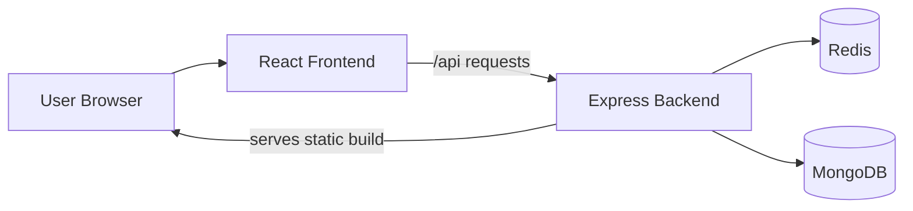
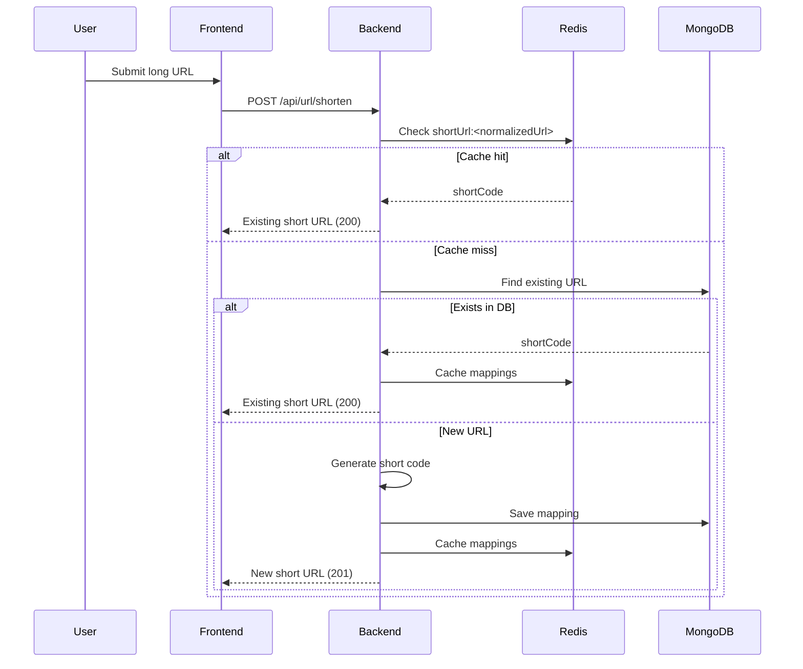
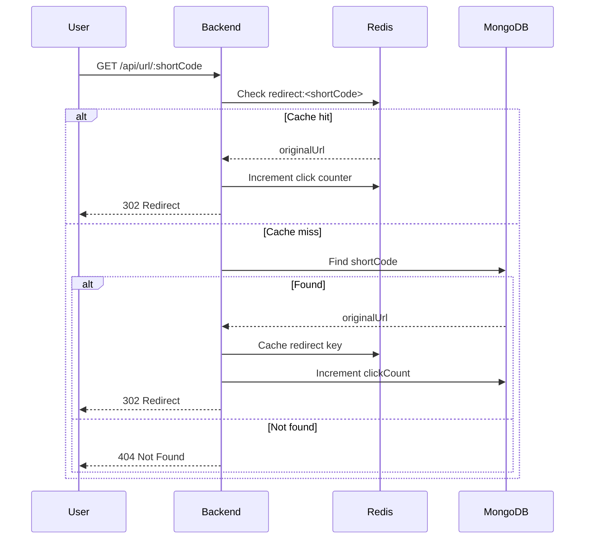

# URL Shortener

Full-stack URL shortener built with React, Express, MongoDB, and Redis.

## Overview

This project provides a complete URL shortening workflow:
- Users submit a long URL.
- Backend normalizes and validates the URL.
- If the URL already exists, the existing short code is returned.
- If not, a new short code is generated and stored.
- Visiting the short code redirects to the original URL.

The application is optimized with Redis for cache lookups and rate-limit storage, with TTL-based expiry for cached mappings and rate-limit keys.

## What This Project Does

- Creates short URLs from long links.
- Redirects short codes to original URLs.
- Uses Redis for fast cache lookups.
- Uses Redis-backed rate limiting on shorten and redirect endpoints.
- Sets TTLs on Redis keys so cached links and rate-limit windows expire automatically.
- Supports user register/login/logout with JWT.
- Serves built frontend directly from backend in containerized mode.

## Tech Stack

- Frontend: React + Vite
- Backend: Node.js + Express
- Database: MongoDB (Mongoose)
- Cache/Rate Limit Store: Redis
- Containerization: Docker (multi-stage build)

## Architecture

High-level components:
- Frontend sends API calls to backend (`/api`).
- Backend handles auth, URL creation, and redirect logic.
- MongoDB stores users and URL mappings.
- Redis caches URL mappings and stores rate-limit counters.
- Redis TTLs are used to expire cached URL mappings and rate-limit entries automatically.

Request path summary:
1. Frontend -> Backend API
2. Backend -> Redis (cache first)
3. Backend -> MongoDB (fallback + persistence)
4. Backend -> Frontend/Browser response

## System Design

### High-Level Design



### URL Shortening Flow



### Redirect Flow



### Design Choices

- Cache-first read strategy improves redirect latency.
- MongoDB is the source of truth for URL mappings.
- Redis is used for both performance (cache) and protection (rate limiting).
- Backend serves frontend build in Docker mode for single-container app deployment.

## Project Structure

```text
.
|-- dockerfile
|-- Backend/
|   |-- server.js
|   |-- package.json
|   |-- src/
|       |-- app.js
|       |-- config/
|       |-- controllers/
|       |-- middleware/
|       |-- models/
|       |-- routes/
|       |-- utils/
|-- Frontend/
|   |-- package.json
|   |-- vite.config.js
|   |-- src/
|       |-- api/
|       |-- components/
|       |-- hooks/
```

## API Endpoints

Base URL: `http://localhost:5000`

Auth:
- `POST /api/user/register`
- `POST /api/user/login`
- `POST /api/user/logout`

URL:
- `POST /api/url/shorten`
- `GET /api/url/:shortCode` (302 redirect)

## API Behavior Details

### `POST /api/url/shorten`
- Input: `originalUrl`
- Validation: URL must be valid; protocol is normalized if missing.
- Cache strategy:
  - Check Redis for existing short code.
  - On miss, check MongoDB.
  - Store new/existing mappings in Redis with TTL so cached entries expire automatically.
- Success codes:
  - `201` when a new short URL is created.
  - `200` when an existing URL mapping is reused.

### `GET /api/url/:shortCode`
- Checks Redis first for redirect target.
- On miss, loads from MongoDB and warms cache.
- Returns `302` redirect on success.
- Returns `404` when short code is not found.

### Auth Endpoints
- Register/login return JWT and set an HTTP-only cookie.
- Logout clears auth cookie.

Example request:

```json
{
  "originalUrl": "https://example.com"
}
```

Example response:

```json
{
  "shortCode": "abc123",
  "shortUrl": "http://localhost:5000/api/url/abc123"
}
```

## Local Setup

### Prerequisites

- Node.js 20+
- MongoDB
- Redis

### 1) Install dependencies

```bash
cd Backend
npm install

cd ../Frontend
npm install
```

### 2) Create backend env file

Create `Backend/.env`:

```env
PORT=5000
MONGODB_URI=mongodb://localhost:27017
JWT_SECRET=replace_with_strong_secret
REDIS_HOST=localhost
REDIS_PASSWORD=
```

Optional frontend env (`Frontend/.env`):

```env
VITE_BACKEND_URL=http://localhost:5000
VITE_API_BASE_URL=/api
```

### 3) Run backend

```bash
cd Backend
npm run serve
```

### 4) Run frontend

```bash
cd Frontend
npm run dev
```

Frontend runs on `http://localhost:5173` and proxies `/api` to backend.

## Environment Variables

Backend:
- `PORT`: API server port.
- `MONGODB_URI`: Mongo host URI (database name is appended in code).
- `JWT_SECRET`: secret used to sign auth tokens.
- `REDIS_HOST`: Redis host.
- `REDIS_PASSWORD`: Redis password (leave empty if not required).

Frontend:
- `VITE_BACKEND_URL`: target used by Vite dev proxy.
- `VITE_API_BASE_URL`: API base path for frontend calls.

## Docker

This repository includes a multi-stage `dockerfile` that:
- builds the frontend,
- installs backend production dependencies,
- serves frontend from backend `public` folder.

How it works:
- Stage 1 builds frontend static files.
- Stage 2 installs backend production dependencies.
- Built frontend `dist` is copied into backend `public`.
- Backend serves both API and frontend from one container.

Build image:

```bash
docker build -t url-shortener-app -f dockerfile .
```

Run container:

```bash
docker run -d \
  --name url-shortener \
  -p 5000:5000 \
  -e PORT=5000 \
  -e MONGODB_URI=mongodb://host.docker.internal:27017 \
  -e JWT_SECRET=replace_with_strong_secret \
  -e REDIS_HOST=host.docker.internal \
  -e REDIS_PASSWORD= \
  url-shortener-app
```

Note: MongoDB and Redis must be available separately (local services or containers).

## Rate Limiting

- Shorten endpoint: 20 requests per 15 minutes.
- Redirect endpoint: 100 requests per hour.
- Limit state is persisted in Redis via `rate-limit-redis` and naturally resets through the configured time window/TTL.

When limit is exceeded:
- API returns `429 Too Many Requests`.
- Frontend handles this and shows retry messaging.

## Current Status

Implemented:
- URL shortening and redirect
- Redis caching
- Rate limiting
- Auth APIs
- Docker image build
- URL normalization and duplicate URL handling
- TTL-based expiration for URL documents in MongoDB
- TTL-based expiry for Redis cache entries and rate-limit keys

Not yet implemented:
- Automated tests
- Docker Compose for full stack
- Route-level auth protection in URL endpoints

## Known Notes

- `authenticateUser` middleware exists but is not wired to URL routes yet.
- Redis connection port is currently hardcoded in backend config.
- Frontend stores token in localStorage and also sends cookies.

## Future Improvements

- Add Docker Compose for app + MongoDB + Redis local orchestration.
- Add analytics APIs (total clicks, top links, daily trends).
- Add custom alias support and link expiration per URL.
- Add automated tests (backend API + frontend component/integration tests).
- Add CI pipeline for lint, test, build, and Docker image build.
- Improve security with refresh tokens, stricter cookie settings, and CORS policy hardening.

